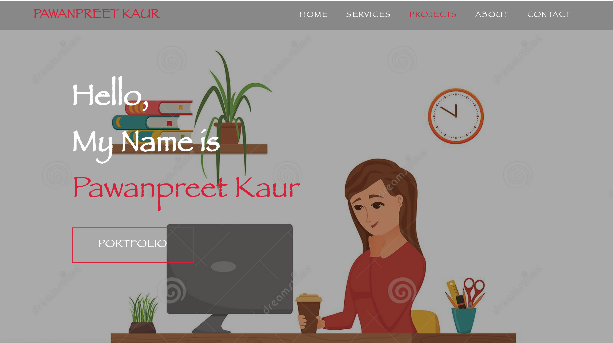

# Portfolio

# About Me
I am Pawanpreet Kaur and currently student with the University of Toronto's coding boot camp. I've always loved technology and have been interested in its design and creation, with the current situation it seemed like a good time to give this goal of mine a go.

# Build with
In my Portfolio, I used Mostly
- HTML
- CSS

After my this portfoilo, I used JavaScript.

# Deployed
https://pawan495.github.io/Portfolio/

# ScreenShot

# Contributions
- UofT courses material, W3S schools, Google(https://www.google.com), CSS Tricks and Sister(jasmeet12.github.io)